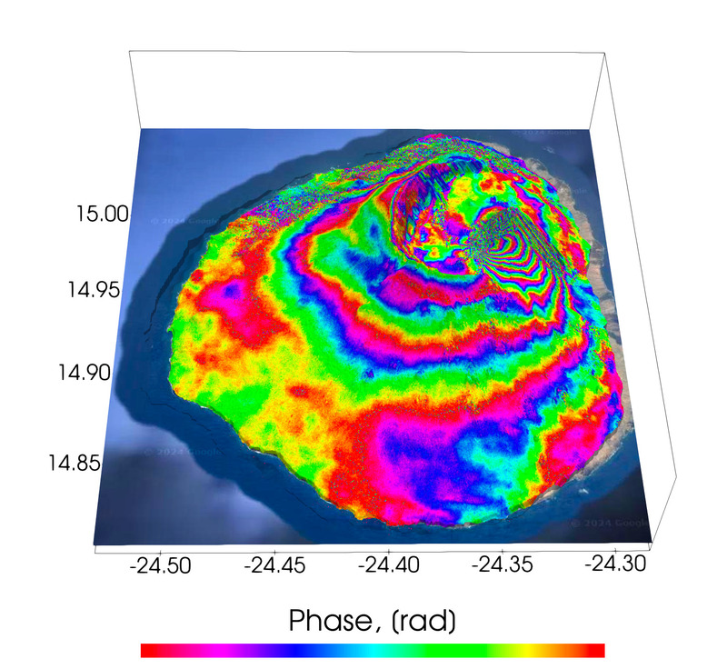
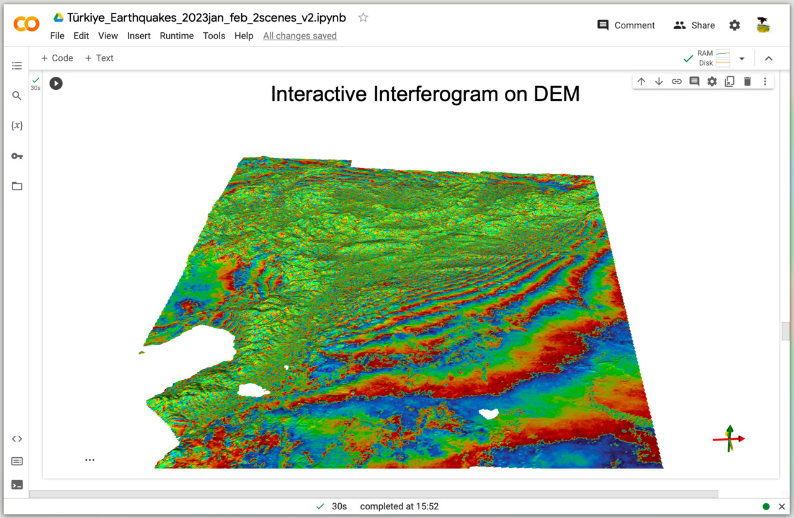
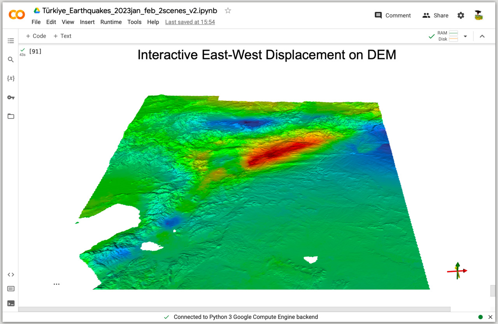
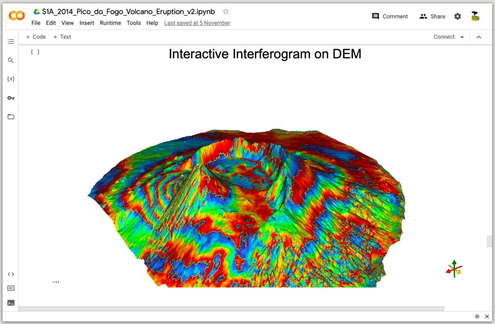
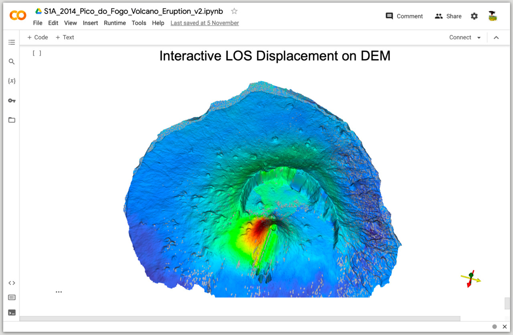

# PyGMTSAR: Python InSAR Processing

[](https://github.com/ernestorojas-dev/pygymstar)
[](https://github.com/AlexeyPechnikov/pygmtsar)
[](https://pypi.python.org/pypi/pygmtsar/)
[](https://github.com/ernestorojas-dev/pygymstar)
[](https://zenodo.org/badge/latestdoi/398018212)
[](https://www.patreon.com/pechnikov)
[](https://opensource.org/licenses/MIT)

<div align="center">
  
</div>

## 🌟 Overview

**PyGMTSAR** (Python InSAR) is a powerful, accessible Python library for Sentinel-1 satellite interferometry. Designed for both beginners and experts, it provides a complete solution for InSAR processing, from data acquisition to 3D visualization.

### ✨ Key Features

- 🚀 **Complete InSAR Pipeline**: From SLC data to final results
- 📊 **Multiple Analysis Methods**: SBAS, PSI, PSI-SBAS, and more
- 🐳 **Docker Ready**: Pre-configured environment with all dependencies
- ☁️ **Cloud Compatible**: Works on Google Colab, AWS, and local machines
- 🎯 **Automated Processing**: Automatic data retrieval, DEM handling, and orbit processing
- 📈 **3D Visualization**: Interactive maps and time-series analysis
- 🔧 **Easy Installation**: Simple pip install or Docker deployment

## 📍 About This Repository

This repository contains PyGMTSAR (Python InSAR) processing tools and examples maintained by [ernestorojas-dev](https://github.com/ernestorojas-dev). This repository includes:

- **Complete PyGMTSAR setup** with all dependencies
- **Custom Docker configurations** optimized for local development
- **Enhanced documentation** with step-by-step guides
- **Comprehensive examples** and test cases
- **Google Colab integration** with ready-to-use notebooks
- **Docker setup guides** for easy deployment

**Repository**: [https://github.com/ernestorojas-dev/pygymstar](https://github.com/ernestorojas-dev/pygymstar)

## 🚀 Quick Start

### Option 1: Docker (Recommended)

```bash
# Build and run from this repository
git clone https://github.com/ernestorojas-dev/pygymstar.git
cd pygmtsar
docker build . -f docker/pygmtsar.Dockerfile -t pygmtsar:latest --no-cache
docker run -dp 8888:8888 --name pygmtsar pygmtsar:latest
docker logs pygmtsar  # Get JupyterLab URL
```

### Option 2: Local Installation

```bash
# Install from PyPI
pip install pygmtsar

# Or install from this repository
git clone https://github.com/ernestorojas-dev/pygymstar.git
cd pygmtsar
pip install -e .
```

### Option 3: Build Docker from This Repository

```bash
# Clone this repository and build Docker image
git clone https://github.com/ernestorojas-dev/pygymstar.git
cd pygmtsar
docker build . -f docker/pygmtsar.Dockerfile -t pygmtsar:latest --no-cache
docker run -dp 8888:8888 --name pygmtsar pygmtsar:latest
```

### Option 4: Google Colab

[](https://colab.research.google.com/drive/1TARVTB7z8goZyEVDRWyTAKJpyuqZxzW2?usp=sharing)

## 📚 Documentation

- 📖 **[Docker Setup Guide](DOCKER_SETUP.md)** - Comprehensive Docker installation and configuration
- ⚡ **[Docker Quick Reference](DOCKER_QUICK_REFERENCE.md)** - Essential Docker commands
- 🎓 **[Interactive Examples](https://insar.dev)** - Live Jupyter notebooks
- 🤖 **[AI Assistant](https://insar.dev/ai)** - ChatGPT-powered InSAR help
- 📚 **[Patreon Resources](https://www.patreon.com/pechnikov)** - Advanced tutorials and e-books

## 🎯 Use Cases

### Earthquake Analysis
- **Central Türkiye Earthquakes (2023)**: Large-scale deformation analysis
- **Iran–Iraq Earthquake (2017)**: Co-seismic interferogram processing

### Volcanic Monitoring
- **Pico do Fogo Volcano (2014)**: Eruption deformation mapping
- **La Cumbre Volcano (2020)**: Real-time monitoring capabilities

### Ground Subsidence
- **Imperial Valley, CA (2015)**: Groundwater-related subsidence
- **Golden Valley, CA (2021)**: Infrastructure monitoring
- **Mexico City (2016)**: Urban subsidence analysis

### Natural Hazards
- **Lake Sarez Landslides (2017)**: Slope stability monitoring
- **Kalkarindji Flooding (2024)**: Flood extent mapping

### DEM Generation
- **Erzincan, Türkiye (2019)**: High-resolution elevation mapping

## 🛠️ System Requirements

| Configuration | RAM | CPU | Storage | Use Case |
|---------------|-----|-----|---------|----------|
| **Minimum** | 2GB | 1 core | 20GB | Basic processing |
| **Recommended** | 8GB | 4 cores | 50GB | Standard analysis |
| **Optimal** | 16GB+ | 8+ cores | 120GB | Large-scale projects |

## 📊 Performance Benchmarks

*Processing times on iMac 2021 (Apple M1, 8 cores, 16GB RAM)*

| Analysis Type | Scenes | Bursts | Interferograms | 2GB RAM | 4GB RAM | 8GB RAM |
|---------------|--------|--------|----------------|---------|---------|---------|
| Lake Sarez Landslides | 19 | 38 | 76 | 38 min | 24 min | 17 min |
| Türkiye Earthquake | 4 | 112 | 1 | 62 min | 33 min | 24 min |
| Golden Valley Subsidence | 30 | 30 | 57 | 18 min | 10 min | 7 min |
| Imperial Valley Groundwater | 5 | - | 9 | 21 min | 12 min | 9 min |

## 🔧 Installation Methods

### Docker Installation

```bash
# Build from this repository
git clone https://github.com/ernestorojas-dev/pygymstar.git
cd pygmtsar
docker build . -f docker/pygmtsar.Dockerfile -t pygmtsar:latest --no-cache
docker run -dp 8888:8888 --name pygmtsar pygmtsar:latest
```

### Local Installation

```bash
# Install dependencies (Ubuntu/Debian)
sudo apt-get update
sudo apt-get install gmt libgmt-dev gdal-bin libgdal-dev

# Install PyGMTSAR
pip install pygmtsar
```

### Development Installation

```bash
# Clone this repository for development
git clone https://github.com/ernestorojas-dev/pygymstar.git
cd pygmtsar
pip install -e .[dev]
```

## 📖 Basic Usage

```python
import pygmtsar

# Initialize stack
stack = pygmtsar.Sentinel1Stack('data_dir', 'dem_file')

# Download Sentinel-1 data
stack.download()

# Process interferograms
stack.intf()

# Perform SBAS analysis
stack.sbas()

# Generate velocity map
velocity = stack.velocity()
```

## 🎨 Visualization Examples

<div align="center">
  
  
</div>

<div align="center">
  
  
</div>

## 🌐 Live Examples

### Google Colab Notebooks

| Example | Description | Colab Link |
|---------|-------------|------------|
| **Central Türkiye Earthquakes (2023)** | Large-scale deformation analysis | [](https://colab.research.google.com/drive/1TARVTB7z8goZyEVDRWyTAKJpyuqZxzW2?usp=sharing) |
| **Pico do Fogo Volcano (2014)** | Volcanic eruption monitoring | [](https://colab.research.google.com/drive/1dDFG8BoF4WfB6tOF5sAi5mjdBKRbhxHo?usp=sharing) |
| **La Cumbre Volcano (2020)** | Real-time volcano monitoring | [](https://colab.research.google.com/drive/1d9RcqBmWIKQDEwJYo8Dh6M4tMjJtvseC?usp=sharing) |
| **Iran–Iraq Earthquake (2017)** | Co-seismic analysis | [](https://colab.research.google.com/drive/1shNGvUlUiXeyV7IcTmDbWaEM6XrB0014?usp=sharing) |
| **Imperial Valley (2015)** | Groundwater subsidence | [](https://colab.research.google.com/drive/1h4XxJZwFfm7EC8NUzl34cCkOVUG2uJr4?usp=sharing) |
| **Kalkarindji Flooding (2024)** | Flood extent mapping | [](https://colab.research.google.com/drive/1aqAr9KWKzGx9XpVie1M000C3vUxzNDxu?usp=sharing) |
| **Golden Valley (2021)** | Infrastructure subsidence | [](https://colab.research.google.com/drive/1ipiQGbvUF8duzjZER8v-_R48DSpSmgvQ?usp=sharing) |
| **Lake Sarez (2017)** | Landslide monitoring | [](https://colab.research.google.com/drive/1O3aZtZsTrQIldvCqlVRel13wJRLhmTJt?usp=sharing) |
| **Erzincan DEM (2019)** | High-resolution elevation | [](https://colab.research.google.com/drive/19PLuebOZ4gaYX5ym1H7SwUbJKfl23qPr?usp=sharing) |

## 🔮 Future: InSAR.dev Ecosystem

**InSAR.dev** is the next evolution of PyGMTSAR, designed for large-scale, multi-polarization, multi-path processing:

- **Scalable Architecture**: Process hundreds of bursts across multiple orbital paths
- **Cloud-Native**: Optimized for distributed processing
- **Multi-Polarization**: VH and VV polarization support
- **Advanced Analytics**: Enhanced time-series and trend analysis

### InSAR.dev Examples

[](https://colab.research.google.com/drive/1KsHRDz1XVtDWAkJMXK0gdpMiEfHNvXB3?usp=sharing) **Sentinel-1 SLC Burst Preprocessing**

[](https://colab.research.google.com/drive/156Gvd-0C7DrXWDe1JCSxJyE-s1FyZeDl?usp=sharing) **Multi-Polarization and Multi-Path Interferograms**

## 🤝 Contributing

We welcome contributions! Please see our [Contributing Guidelines](CONTRIBUTING.md) for details.

### Development Setup

```bash
# Fork and clone this repository
git clone https://github.com/ernestorojas-dev/pygymstar.git
cd pygmtsar
pip install -e .[dev]
pre-commit install
```

## 📄 License

This project is licensed under the MIT License - see the [LICENSE.TXT](LICENSE.TXT) file for details.

## 🙏 Acknowledgments

- **GMTSAR Team**: For the foundational GMTSAR software
- **ESA**: For Sentinel-1 data and documentation
- **Community**: For feedback, bug reports, and contributions

## 📞 Support & Community

- 🐛 **Bug Reports**: [GitHub Issues](https://github.com/AlexeyPechnikov/pygmtsar/issues)
- 💬 **Discussions**: [GitHub Discussions](https://github.com/AlexeyPechnikov/pygmtsar/discussions)
- 📧 **Email**: Contact through [LinkedIn](https://www.linkedin.com/in/alexey-pechnikov/)
- 💰 **Premium Support**: [Patreon](https://www.patreon.com/pechnikov)
- 🤖 **AI Assistant**: [insar.dev/ai](https://insar.dev/ai)

## 📚 Additional Resources

- 📖 **Documentation**: [pechnikov.dev](https://pechnikov.dev)
- 🎥 **Video Tutorials**: [YouTube Channel](https://www.youtube.com/channel/UCSEeXKAn9f_bDiTjT6l87Lg)
- 📊 **Interactive Examples**: [insar.dev](https://insar.dev)
- 🐳 **Docker Build**: Build from [this repository](https://github.com/ernestorojas-dev/pygymstar)
- 📦 **PyPI Package**: [pygmtsar](https://pypi.python.org/pypi/pygmtsar/)

---

<div align="center">
  <strong>Made with ❤️ for the InSAR community</strong><br>
  <em>© ernestorojas-dev, 2025</em>
</div>
