[](https://github.com/AlexeyPechnikov/pygmtsar)
[](https://pypi.python.org/pypi/pygmtsar/)
[](https://hub.docker.com/r/pechnikov/pygmtsar)
[](https://zenodo.org/badge/latestdoi/398018212)
[](https://www.patreon.com/pechnikov)

## Announcement: InSAR.dev—A Federated Python Ecosystem for InSAR

InSAR.dev is the next evolution of PyGMTSAR and is under active development. Whereas PyGMTSAR processes single-polarization scenes and bursts along one orbital path, InSAR.dev separates the workflow into two phases: preparing SLC data (including geocoding, flat-earth and topographic correction, and packaging into cloud-ready bursts) and then performing the core interferometric analysis on those datasets. This design scales to hundreds or thousands of bursts across multiple polarizations and orbital paths.

For example, the following interactive notebooks demonstrate processing of 8 Sentinel-1 scenes (~1000 bursts) across 2 orbital paths and 2 polarizations (VH, VV):

[](https://colab.research.google.com/drive/1KsHRDz1XVtDWAkJMXK0gdpMiEfHNvXB3?usp=sharing) InSAR.dev Sentinel-1 SLC Burst Preprocessing.

[](https://colab.research.google.com/drive/156Gvd-0C7DrXWDe1JCSxJyE-s1FyZeDl?usp=sharing) InSAR.dev Sentinel‑1 Multi‑Polarization and Multi‑Path Interferograms (adopted for slow 2 vCPU free Google Colab).

[](https://colab.research.google.com/drive/1g_mZK6YZ614t45D1zKCO-U_X5E6hfknz?usp=sharing) InSAR.dev Sentinel‑1 Multi‑Polarization and Multi‑Path Interferograms on Google Colab Pro.

The InSAR.dev ecosystem comprises three Python packages. **insardev_toolkit** provides utility functions and helpers; **insardev_pygmtsar**handles Sentinel‑1 SLC preprocessing (requires GMTSAR binaries); and **insardev** performs core interferometric processing and analysis with no external dependencies. Both **insardev_toolkit** and **insardev_pygmtsar** are BSD‑licensed, while **insardev** may require a subscription for certain use cases.

InSAR.dev documentation, use cases and project updates are available on [Patreon](https://www.patreon.com/pechnikov).


## PyGMTSAR (Python InSAR): Powerful, Accessible Satellite Interferometry


PyGMTSAR (Python InSAR) is designed for both occasional users and experts working with Sentinel-1 satellite interferometry. It supports a wide range of features, including SBAS, PSI, PSI-SBAS, and more. In addition to the examples below, you’ll find more Jupyter notebook use cases on [Patreon](https://www.patreon.com/pechnikov) and updates on [LinkedIn](https://www.linkedin.com/in/alexey-pechnikov/).

## About PyGMTSAR

PyGMTSAR offers reproducible, high-performance Sentinel-1 interferometry accessible to everyone—whether you prefer Google Colab, cloud servers, or local processing. It automatically retrieves Sentinel-1 SLC scenes and bursts, DEMs, and orbits; computes interferograms and correlations; performs time-series analysis; and provides 3D visualization. This single library enables users to build a fully integrated InSAR project with minimal hassle. Whether you need a single interferogram or a multi-year analysis involving thousands of datasets, PyGMTSAR can handle the task efficiently, even on standard commodity hardware.

## Docker Setup

For local development and processing, PyGMTSAR provides a comprehensive Docker image with all dependencies pre-installed.

### Quick Start with Docker

```bash
# Pull and run the pre-built image
docker pull pechnikov/pygmtsar
docker run -dp 8888:8888 --name pygmtsar pechnikov/pygmtsar
docker logs pygmtsar  # Get JupyterLab URL
```

### Build from Source

```bash
# Clone and build
git clone https://github.com/AlexeyPechnikov/pygmtsar.git
cd pygmtsar
docker build . -f docker/pygmtsar.Dockerfile -t pygmtsar:latest --no-cache
docker run -dp 8888:8888 --name pygmtsar pygmtsar:latest
```

📖 **Detailed Docker Documentation**: See [DOCKER_SETUP.md](DOCKER_SETUP.md) for comprehensive setup instructions, troubleshooting, and advanced configuration options.

## PyGMTSAR Live Examples on Google Colab

Google Colab is a free service that lets you run interactive notebooks directly in your browser—no powerful computer, extensive disk space, or special installations needed. You can even do InSAR processing from a smartphone. These notebooks automate every step: installing PyGMTSAR library and its dependencies on a Colab host (Ubuntu 22, Python 3.10), downloading Sentinel-1 SLCs, orbit files, SRTM DEM data (automatically converted to ellipsoidal heights via EGM96), land mask data, and then performing complete interferometry with final mapping. You can also modify scene  or bursts names to analyze your own area of interest, and each notebook includes instant interactive 3D maps.

[](https://colab.research.google.com/drive/1TARVTB7z8goZyEVDRWyTAKJpyuqZxzW2?usp=sharing) **Central Türkiye Earthquakes (2023).** The area is large, covering two consecutive Sentinel-1 scenes or a total of 56 bursts.

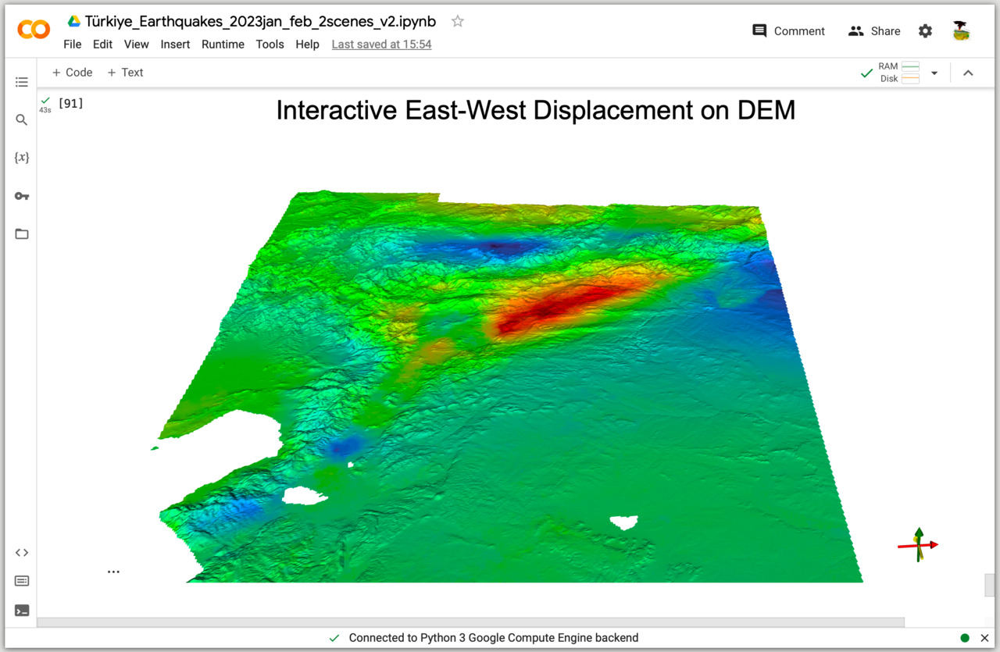

[](https://colab.research.google.com/drive/1dDFG8BoF4WfB6tOF5sAi5mjdBKRbhxHo?usp=sharing) **Pico do Fogo Volcano Eruption, Fogo Island, Cape Verde (2014).** The interferogram for this event is compared to the study *The 2014–2015 eruption of Fogo volcano: Geodetic modeling of Sentinel-1 TOPS interferometry* (*Geophysical Research Letters*, DOI: [10.1002/2015GL066003](https://doi.org/10.1002/2015GL066003)).

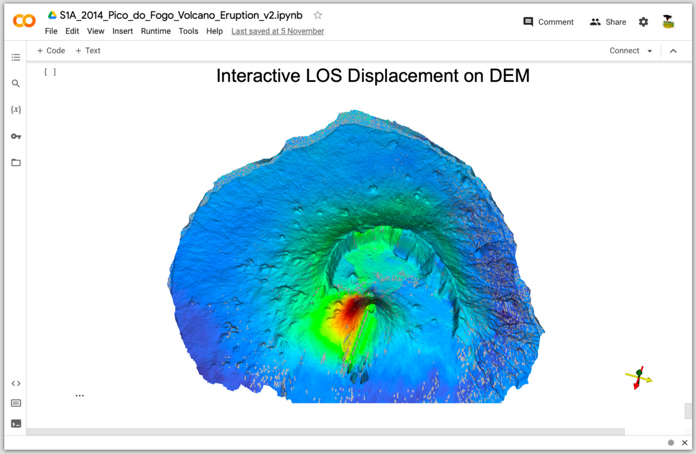

[](https://colab.research.google.com/drive/1d9RcqBmWIKQDEwJYo8Dh6M4tMjJtvseC?usp=sharing) **La Cumbre Volcano Eruption, Ecuador (2020).** The results compare with the report from Instituto Geofísico, Escuela Politécnica Nacional (IG-EPN) (InSAR software unspecified).

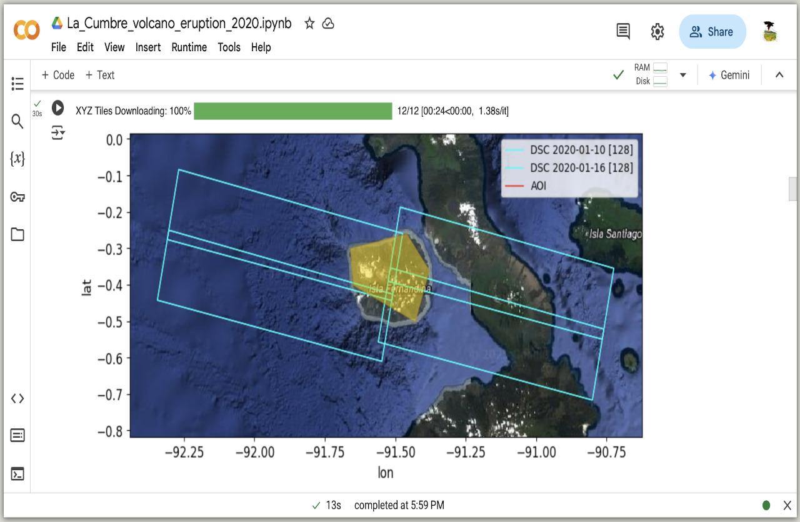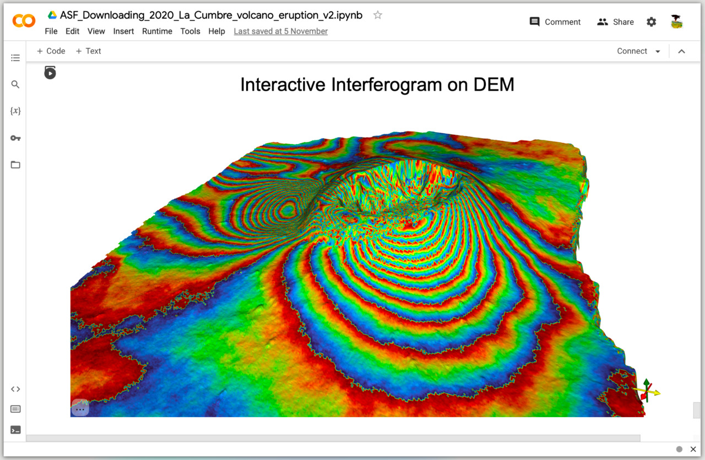

[](https://colab.research.google.com/drive/1shNGvUlUiXeyV7IcTmDbWaEM6XrB0014?usp=sharing) **Iran–Iraq Earthquake (2017).** The event has been well investigated, and the results compared to outputs from GMTSAR, SNAP, and GAMMA software.

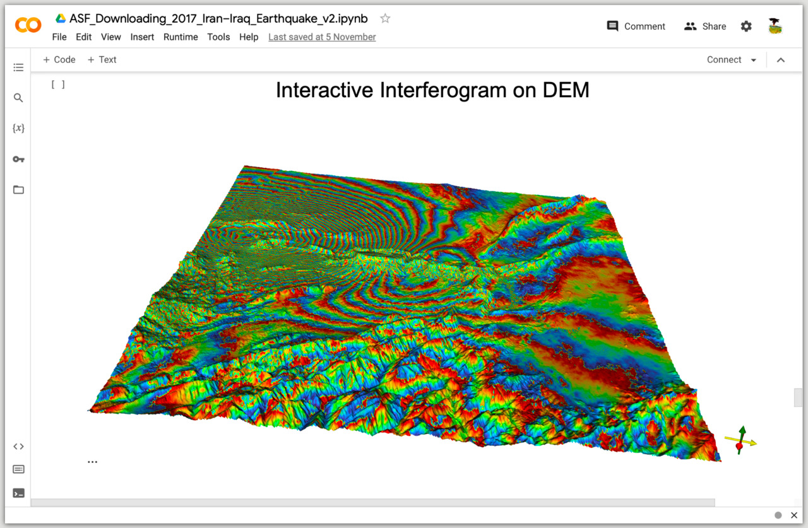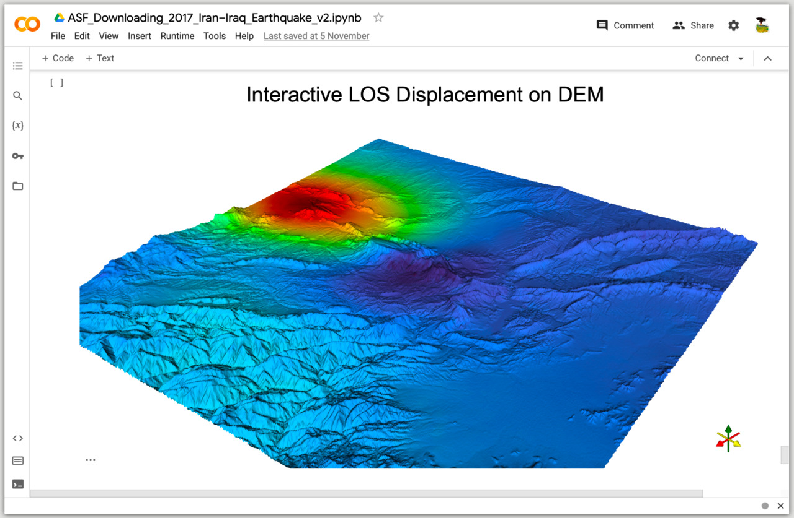

[](https://colab.research.google.com/drive/1h4XxJZwFfm7EC8NUzl34cCkOVUG2uJr4?usp=sharing) **Imperial Valley Subsidence, CA USA (2015).**  This example is provided in the [GMTSAR project](https://topex.ucsd.edu/gmtsar/downloads/) in the archive file [S1A_Stack_CPGF_T173.tar.gz](http://topex.ucsd.edu/gmtsar/tar/S1A_Stack_CPGF_T173.tar.gz), titled 'Sentinel-1 TOPS Time Series'.

The resulting InSAR velocity map is available as a self-contained web page at: [Imperial_Valley_2015.html](https://insar.dev/ui/Imperial_Valley_2015.html)

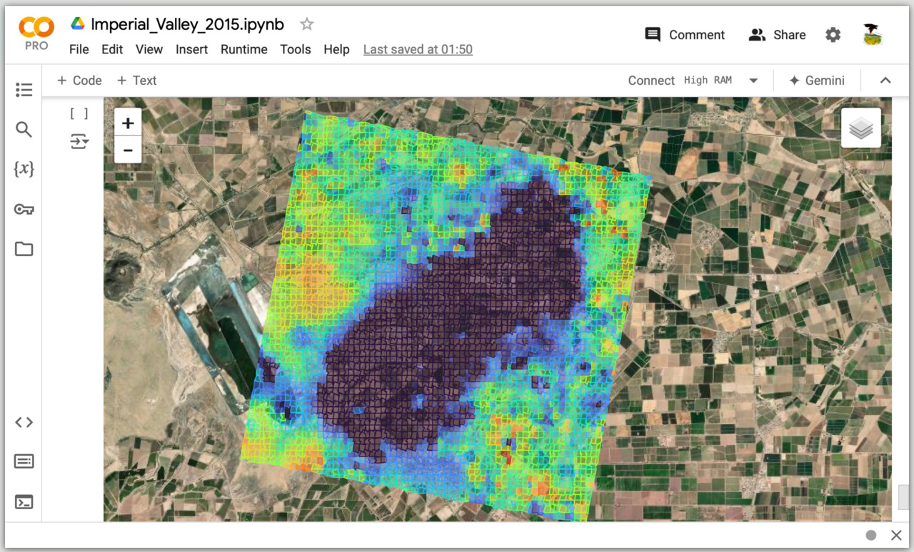 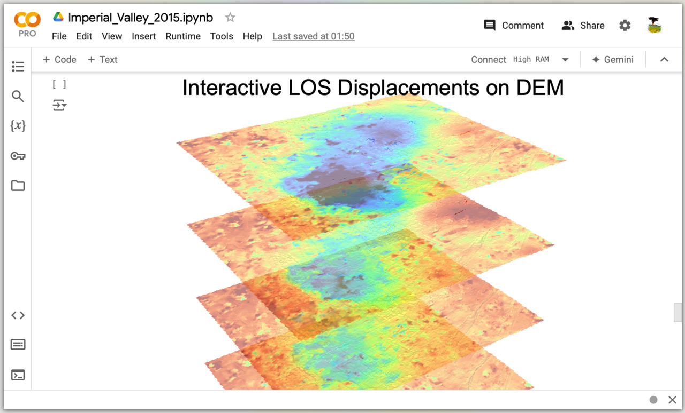

[](https://colab.research.google.com/drive/1aqAr9KWKzGx9XpVie1M000C3vUxzNDxu?usp=sharing) **Kalkarindji Flooding, NT Australia (2024).** Correlation loss serves to identify flooded areas.

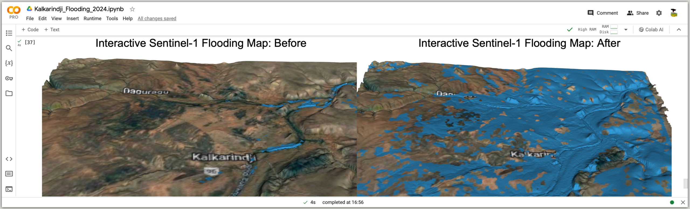

[](https://colab.research.google.com/drive/1ipiQGbvUF8duzjZER8v-_R48DSpSmgvQ?usp=sharing) **Golden Valley Subsidence, CA USA (2021).** This example demonstrates the case study 'Antelope Valley Freeway in Santa Clarita, CA,' as detailed in [SAR Technical Series Part 4 Sentinel-1 global velocity layer: Using global InSAR at scale](https://blog.descarteslabs.com/using-global-insar-at-scale) and [Sentinel-1 Technical Series Part 5 Targeted Analysis](https://blog.descarteslabs.com/sentinel-1-targeted-analysis) with a significant subsidence rate 'exceeding 5cm/year in places'.

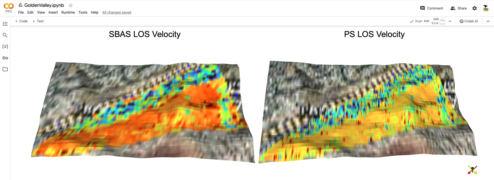

[](https://colab.research.google.com/drive/1O3aZtZsTrQIldvCqlVRel13wJRLhmTJt?usp=sharing) **Lake Sarez Landslides, Tajikistan (2017).** The example reproduces the findings shared in the following paper: [Integration of satellite SAR and optical acquisitions for the characterization of the Lake Sarez landslides in Tajikistan](https://www.google.com/url?q=https%3A%2F%2Fwww.researchgate.net%2Fpublication%2F378176884_Integration_of_satellite_SAR_and_optical_acquisitions_for_the_characterization_of_the_Lake_Sarez_landslides_in_Tajikistan).

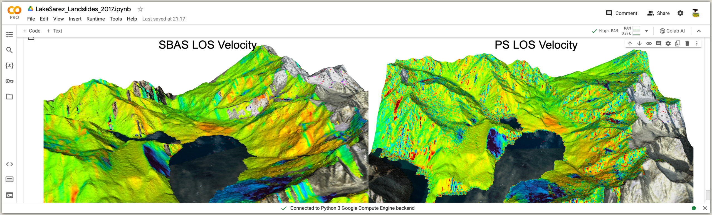

[](https://colab.research.google.com/drive/19PLuebOZ4gaYX5ym1H7SwUbJKfl23qPr?usp=sharing) **Erzincan Elevation, Türkiye (2019).** This example reproduces 29-page ESA document [DEM generation with Sentinel-1 IW](https://step.esa.int/docs/tutorials/S1TBX%20DEM%20generation%20with%20Sentinel-1%20IW%20Tutorial.pdf).


## More PyGMTSAR Live Examples on Google Colab

[](https://colab.research.google.com/drive/1yuuA1ES2ly4QG3hyPg8YYT0nnpGDiQDw?usp=sharing) **Mexico City Subsidence, Mexico (2016).** This example replicates the 29-page ESA manual [TRAINING KIT – HAZA03. LAND SUBSIDENCE WITH SENTINEL-1 using SNAP](https://eo4society.esa.int/wp-content/uploads/2022/01/HAZA03_Land-Subsidence_Mexico-city.pdf).

## PyGMTSAR Live Examples on Google Colab Pro

I share additional InSAR projects on Google Colab Pro through my [Patreon page](https://www.patreon.com/pechnikov). These are ideal for InSAR learners, researchers, and industry professionals tackling challenging projects with large areas, big stacks of interferograms, low-coherence regions, or significant atmospheric delays. You can run these privately shared notebooks online with Colab Pro or locally/on remote servers.

## Projects and Publications Using PyGMTSAR

See the [Projects and Publications](/pubs/README.md) page for real-world projects and academic research applying PyGMTSAR. This is not an exhaustive list—contact me if you’d like your project or publication included.

## Resources

**PyGMTSAR projects and e-books**
Available on [Patreon](https://www.patreon.com/c/pechnikov/shop). Preview versions can be found in this GitHub repo:

- [PyGMTSAR Introduction Preview](https://github.com/AlexeyPechnikov/pygmtsar/blob/pygmtsar2/book/PyGMTSAR_preview.pdf)  
- [PyGMTSAR Gaussian Filtering Preview](https://github.com/AlexeyPechnikov/pygmtsar/blob/pygmtsar2/book/Gaussian_preview.pdf)

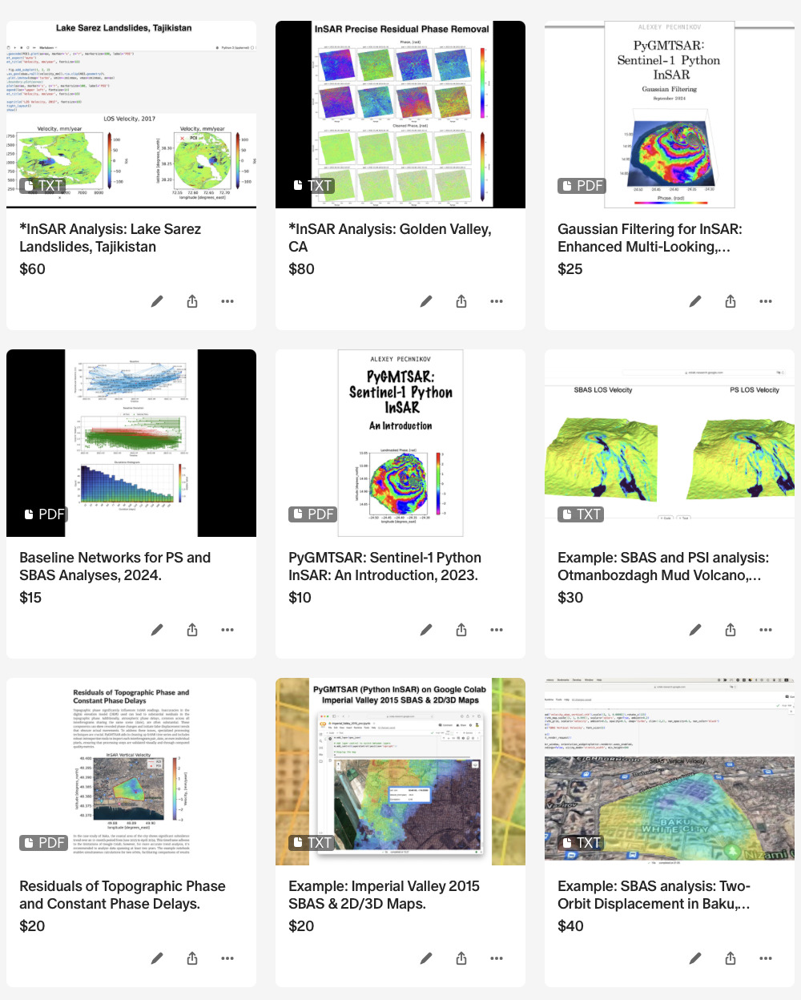

**Video Lessons and Notebooks**
Find PyGMTSAR (Python InSAR) video lessons and educational notebooks on [Patreon](https://www.patreon.com/collection/12458) and [YouTube](https://www.youtube.com/channel/UCSEeXKAn9f_bDiTjT6l87Lg).

**PyGMTSAR AI Assistant**
The [PyGMTSAR AI Assistant](https://insar.dev/ai), powered by OpenAI ChatGPT, can explain InSAR theory, guide you through examples, help build an InSAR processing pipeline, and troubleshoot.

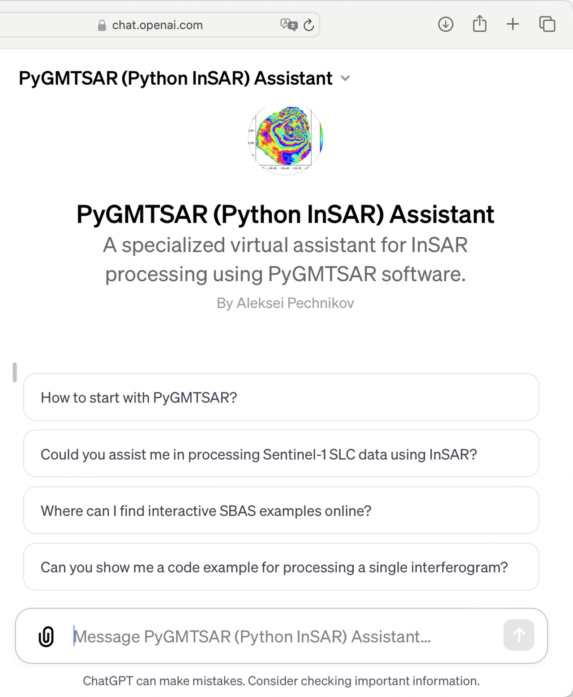

**PyGMTSAR on DockerHub**
Run InSAR processing on macOS, Linux, or Windows via [Docker images](https://hub.docker.com/r/pechnikov/pygmtsar).

**PyGMTSAR on PyPI**
Install the library from [PyPI](https://pypi.python.org/pypi/pygmtsar).

**PyGMTSAR Previous Versions**
2023 releases are still on GitHub, PyPI, DockerHub, and Google Colab. Compare PyGMTSAR InSAR with other software by checking out the [PyGMTSAR 2023 Repository](https://github.com/AlexeyPechnikov/pygmtsar/tree/pygmtsar).

© Alexey Pechnikov, 2025
